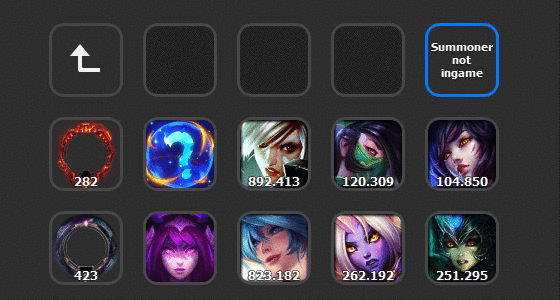

# StreamDeck-Riot Games API
 It is an unofficial plugin that takes the Riot Games API, which lets you display information about LOL / LOR / VR / 
 ### Leauge of Legends

 
  ### Spectate Mode ADDED |  Frist Version

## Installing plugin

**Note:** The installation and use of plugins is done at your own risk.

1. Make sure you're on the latest version of the Stream Deck software by checking for updates in the app.
2. Browse the list below. Once you find a plugin you like, hit the 'Download' link to be taken to the list of releases. Pick the most recent version (generally the best option), which will download a '.streamDeckPlugin' file to your computer.
3. Open the new file by double-clicking on it or launching from your browser. The Stream Deck app will open, and the new plugin will have loaded one or more actions under the 'Riot Games API' header at the bottom-right. Drag the new action onto your Stream Deck and get streaming!

## Usage StreamDeck-Riot Games API

### `How to update`

If you press the Action key, you will get the updated Riot Games API condition instantly! Otherwise, the Riot Games! Otherwise, the Riot Games API is automatically updated by your refresh settings. 

#### `Title`

Leave the title empty, the title is automatically set with the current Riot Games API condition.

#### `Riot Games API Key`

 To obtain a Riot Games API Key, you will need go through the following steps:

1. Create your account here: https://developer.riotgames.com/
2. Go to https://developer.riotgames.com/app-type and create a PERSONAL API KEY. Now you should see your newly creaty API Key, which you will want to paste in here.
3. Rate Limits for the API is
    1. 20 requests every 1 seconds
    2. 100 requests every 2 minutes

#### `Automatic Refresh`

If you want the Riot Games API information to be loaded when the actions are loaded, turn on this setting. 
The following conditions must be met for the automatic refresh to be triggered:

1. StreamDeck is restarting.
2. Switching profiles.

# Change Log

### Version 0.16 is out!
- Added several HTML versions for each different action
    1. League of Legends
          6. Spectate Game ( View the players in Game and what stats they have )
    
     
### Version 0.11 is out!
- Added Property Inspector with multiple UI elements 
    1. League of Legends
        1. Summoner information
            1.  Summoner Level
            2.  Summoner Icon
            3.  Total Champion MasteryPoints
            4.  Champion MasteryPoints ( Pick a champion )
            5.  Top 5 MasteryPoints

    2. Teamfight Tactics (still at work)
    3. Legends of Runeterra (still at work)
    4. Valorant (still at work)

## Issues ?

Please report your issues here https://github.com/Shiirroo/StreamDeck-RiotAPI/issues. I will be working on this plugin for a while to make it even better. I would appreciate if you let me know the problems you run into during your usage.

## Developed By

@Shiro

With the support of 
                    @tarikguney https://github.com/tarikguney
                and 
                    @elgatosf https://github.com/elgatosf
